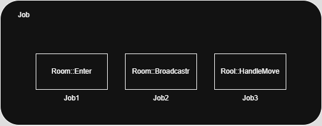

   
# 역할   
- 실행 단위를 캡슐화하여 JobQueue 등에 넣어 비동기/지연 실행이 가능한 구조를 제공
- 일반 함수, 람다, 멤버 함수 호출을 std::function<void()>로 래핑하여 실행할 수 있게 함   
- JobQueue 등에서 로직 단위 처리에 사용됨

## 클래스 구조 요약   
```cpp
using Callback = std::function<void()>;

class Job
{
    Callback _callback; // 실행될 함수 객체
};
```

## 생성자 설명   
### Job(Callback&& callback)   
```cpp
template<typename T, typename Ret, typename... Args>
Job(shared_ptr<T> owner, Ret(T::* memFunc)(Args...), Args&&... args)
```
- 특정 객체의 멤버 함수를 인자로 받아 캡슐화   
- owner.get()->*memFunc(args...) 형태로 래핑하여 실행   
- 캡처된 owner로 인해 lifetime도 보장됨 (shared_ptr 유지)
   
## 실행 흐름   
- Execute() 호출 시 내부 _callback()이 실행됨
- 로직과 실행 타이밍을 분리할 수 있어 스레드 간 안전한 전달 가능   
