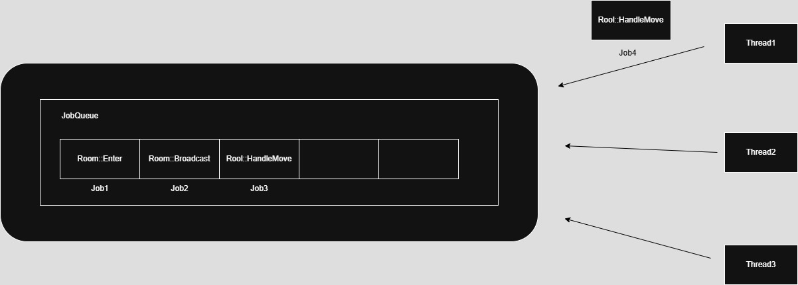

   
# 역할   
- 개별 단위 객체(GameRoom 등)의 로직을 Job 단위로 실행하는 단일 스레드 기반 작업 큐   
- Job을 큐에 누적하고, Execute() 시 순차 처리 보장   
- GlobalQueue와 연계되어 멀티스레드 환경에서도 동시성 없이 순서 보장 실행   
   
## 주요 메서드 설명   
### void DoAsync(...)   
- Job 등록   
- 멤버 함수 캡슐화 또는 람다 기반 Callback 등록 가능   
- 내부적으로 ObjectPool<Job>를 통해 JobRef 생성 후 Push() 호출
   
### void DoTimer(...)   
- 일정 시간 후 실행할 Job 예약   
- GJobTimer->Reserve()를 통해 등록됨   
   
### void Push(JobRef job, bool pushOnly = false)   
- 새로운 Job을 내부 _jobs 큐에 추가   
- _jobCount가 0 → 즉시 실행하거나 GlobalQueue에 등록하여 다른 스레드가 처리   
- pushOnly == true인 경우 현재 스레드는 실행하지 않고 대기   
   
### void Execute()   
- LCurrentJobQueue = this로 설정 → 현재 스레드의 JobQueue 지정   
- _jobs.PopAll() → 순차 실행   
- 시간이 초과되거나 JobCount가 모두 처리되면 루프 종료
- 시간이 초과되면 다시 GGlobalQueue에 자신을 재등록하여 후속 처리 요청   
   
### void ClearJob()    
- 큐에 남은 모든 Job 제거   
