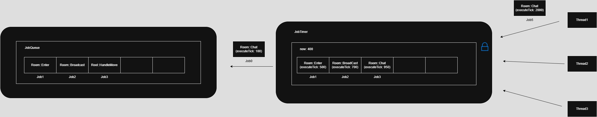

   
# 역할   
- 특정 시간 후 실행할 Job을 예약하는 타이머 시스템   
- 내부적으로 TimerItem 우선순위 큐(min-heap)를 사용하여 실행 시점을 기준으로 Job을 관리   
- 분배(Distribute) 시점에 현재 tick과 비교하여 실행할 Job들을 각자의 JobQueue로 전달

## 주요 메서드 설명   
### void Reserve(uint64 tickAfter, weak_ptr<JobQueue> owner, JobRef job)   
- tickAfter 밀리초 후 실행될 Job을 예약   
- GetTickCount64() + tickAfter → 실행 시각 계산   
- JobData 객체는 ObjectPool에서 할당   
- _items에 TimerItem으로 push (우선순위 큐)   
   
### void Distribute(uint64 now)   
- 현재 시각(now) 기준으로 실행 가능한 Job만 꺼내서 각 JobQueue로 전달   
- owner.lock()을 통해 아직 살아있는 Queue에만 전달   
- 처리된 JobData는 ObjectPool에 반납   
   
### void Clear()   
- 타이머에 남아있는 모든 Job을 제거하며 ObjectPool로 반환   
