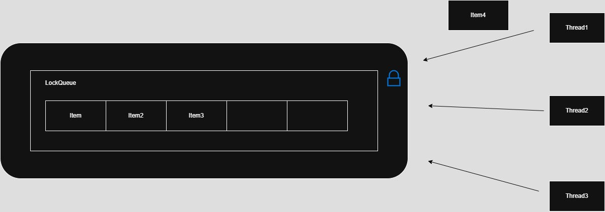

   
# 역할   
- 멀티스레드 환경에서도 안전하게 데이터를 큐잉할 수 있도록 락을 적용한 큐 컨테이너   
- 내부적으로 queue를 감싸고, 락을 사용해 thread-safe 보장   
   
## 주요 메서드 설명   
### void Push(T item)   
- 쓰기 락을 걸고 데이터를 큐에 추가   
   
### T Pop()   
- 쓰기 락을 걸고 큐에서 데이터를 꺼냄   
- 비어있으면 default 생성된 T 반환
   
### void Clear()   
- 내부 큐를 비움 (초기화)   
   
### void PopAll(Vector<T>& items)   
- 모든 데이터를 일괄 추출하여 전달된 벡터에 저장   
- 반복적으로 Pop()을 호출하되, 락은 외부 루프에서 한 번만 잡음   
