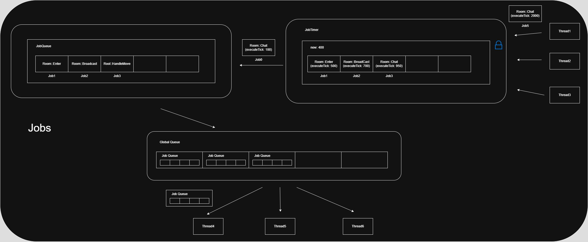

   
# 개요   
- Jobs/ 디렉토리는 비동기 로직 처리 시스템의 요소들을 모아둠.   
- GameRoom, Session 등 로직 이 디렉토리를 기반으로 로직 실행을 순차적이게 처리.

## 구성 요소 요약

| 파일명 | 설명 | 
|--------|------|
| [Job](./Job) | 실행 단위(Job)를 함수 객체 형태로 래핑 (std::function<void()>) |
| [JobQueue](./JobQueue) | 단일 소유 객체의 Job 큐 (ex. GameRoom), 순차 처리 보장 |
| [GlobalQueue](./GlobalQueue) | 실행 가능한 JobQueue 목록 관리 (스레드 간 분배용) |
| [JobTimer](./JobTimer) |  시간 기반 Job 예약/분배 처리기 (Reserve, Distribute) |
| [LockQueue](./LockQueue) | 내부 큐에 대한 thread-safe 자료구조 (spinlock 기반 등) |
   
## 사용 방식   
- 로직은 DoAsync(), DoTimer() 등으로 Job으로 등록   
- 등록된 Job은 조건에 따라 즉시 실행되거나, GlobalQueue에 등록되어 LogicThread에서 처리됨   
- ThreadPool 또는 ThreadManager는 GlobalQueue를 통해 실행 가능한 JobQueue를 순차적으로 가져와 Execute()   

## 흐름 요약   
[DoAsync/DoTimer] → JobQueue::Push() → GlobalQueue::Push() → LogicThread → JobQueue::Execute()   
