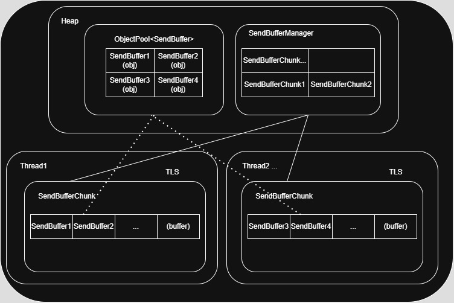
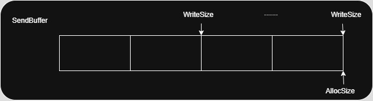
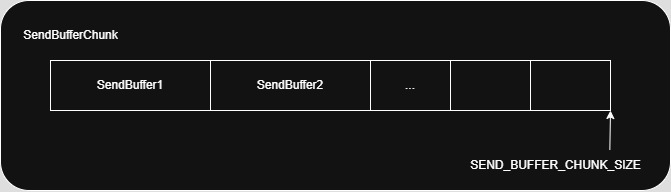

   
   
   
   

# 역할   
- SendBufferManager: 네트워크 전송용 버퍼를 관리하는 전역 매니저   
- SendBufferChunk: 큰 메모리 블록(6000B)에서 작은 단위로 SendBuffer를 잘라서 제공   
- SendBuffer: 실제 WSASend에 넘기는 데이터 블록 단위   
- 메모리 할당 최소화 + 스레드별 고속 재사용을 위해 설계됨
   
## 구조 요약
```
[SendBufferManager]
  └── [TLS: LSendBufferChunk]
        └── [SendBuffer1]
        └── [SendBuffer2]
        └── [...]
```
- 스레드마다 하나의 SendBufferChunk를 TLS에 보관   
- 부족하면 새로운 Chunk를 Pull해서 채워 넣음   

## 주요 메서드 설명   
### SendBufferRef SendBufferManager::Open(uint32 size)   
- 현재 TLS Chunk에서 size만큼 공간을 할당받아 SendBuffer 생성   
- 공간이 부족하면 새 Chunk를 Pop()해서 교체 후 다시 시도   
   
### SendBufferRef SendBufferChunk::Open(uint32 allocSize)   
- 현재 Chunk가 비어있고, 요청 크기만큼 FreeSpace가 있으면 SendBuffer 생성   
- ObjectPool<SendBuffer> 기반으로 관리됨
   
### void SendBuffer::Close(uint32 writeSize)   
- 데이터 작성 완료 후 사용한 바이트 수를 기록하고
- Chunk에 사용량을 보고하여 다음 버퍼 준비   
   
### SendBufferChunk::Reset()   
- Chunk를 초기화하여 재사용 가능하게 만듦 (_usedSize = 0)   
   
### SendBufferChunkRef SendBufferManager::Pop()   
- 내부 Vector 스택에서 Chunk를 꺼내오거나, 부족하면 새로 생성   
