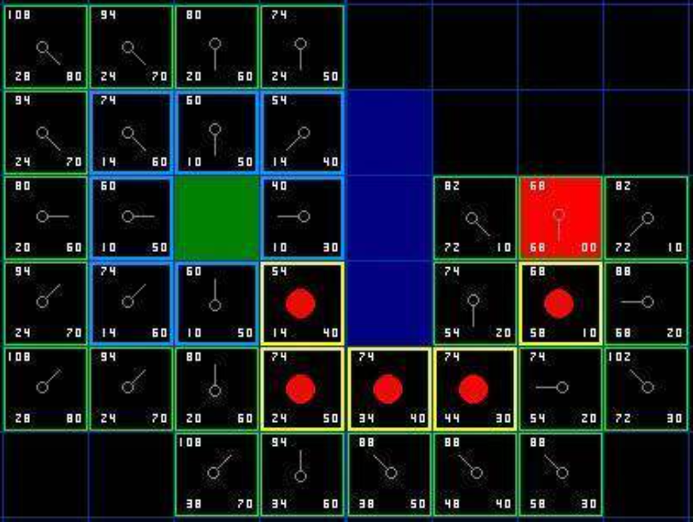

# A* 알고리즘   
   
A* (A-Star)는 시작점에서 목표점까지 최적 경로를 찾는 휴리스틱 기반 탐색 알고리즘입니다.   
다익스트라 알고리즘과 유사하지만, 거리 + 예상 거리(h) 를 함께 고려해 탐색 효율이 좋음   
일반적으로 가장 작은 f(n)을 찾기 위해 우선순위 큐를 사용.   
현재 노드에서 목표 노드까지의 예상 비용을 구하는 함수 h(n)을 휴리스틱 함수라고 함.   
단순하고 대표적인 휴리스틱 함수는 맨해튼, 유클리드 거리 함수.   

## A*의 평가 함수
```
f(n) = g(n) + h(n)

g(n): 시작 노드부터 현재 노드까지의 비용   
h(n): 현재 노드에서 목표 노드까지의 예상 비용 (휴리스틱, 보통 맨해튼 거리)
```

## 2D 에서의 A* 구현 핵심
```
0: 이동 가능

1: 벽(장애물)

시작점 (예: {0, 0})

목표점 (예: {4, 4})

상하좌우 4방향 탐색
```

## 핵심 개념

| 항목 | 설명 |
|------|------|
| `Vec2` | 2D 좌표 구조체 |
| `g`     | 누적 이동 거리 |
| `h`     | 목표까지의 예측 거리 (맨해튼 거리 사용) |
| `f`     | 총 예상 비용 |
| `cameFrom` | 경로 재구성을 위한 부모 정보 |
| `closed` | 중복 탐색 방지를 위한 방문 집합 |
| `map[y][x]` | 0 = 이동 가능, 1 = 벽 또는 장애물 |

---

## 예시 맵

```text
0 0 0 0 0
0 1 1 1 0
0 0 0 1 0
0 1 0 0 0   

0: 이동 가능   
1: 이동 불가능 (벽)   

시작 지점: (0, 0)
도착 지점: (4, 4)

## 실행 예시
(0,0) (1,0) (2,0) (3,0) (4,0) (4,1) (4,2) (4,3) (4,4)
```


## 로직 흐름 상세 설명
1. 초기 설정   
- openSet(열린목록) : 현재 위치에서 지나갈 수 있는 위치를 넣어줌. 이전 노드를 부모로 지정. 우선순위 큐 → (f(n), 위치) 넣음
- closeSet(닫힌 목록) : 지나간 위치는 다시 지나가지 않도록 위치를 닫힌 목록에 추가.
- came_from (경로) : 현재 위치에 오기 전 위치를 저장.
- g(n): 시작 → 현재까지 누적 거리   
- h(n): 휴리스틱 (맨해튼 거리)   
- f(n) = g(n) + h(n)   

2. 루프 시작   
- openSet f(n)이 가장 작은 노드 꺼냄   
- 해당 노드를 방문 목록(closeSet)에 기록    

3. 이웃 노드 탐색   
- 상하좌우 이동 시도   
- 벽(1)인 경우 무시   

- 처음 방문하거나 더 짧은 경로 발견 시:   
   - 탐색한 이웃 노드의 g 비용 업데이트   
   - 탐색한 노드의 cameFrom 갱신   
   - openSet 삽입
   
4. 목표 도달 시 종료   
- 목표 지점에서 cameFrom 따라 경로 복원   


